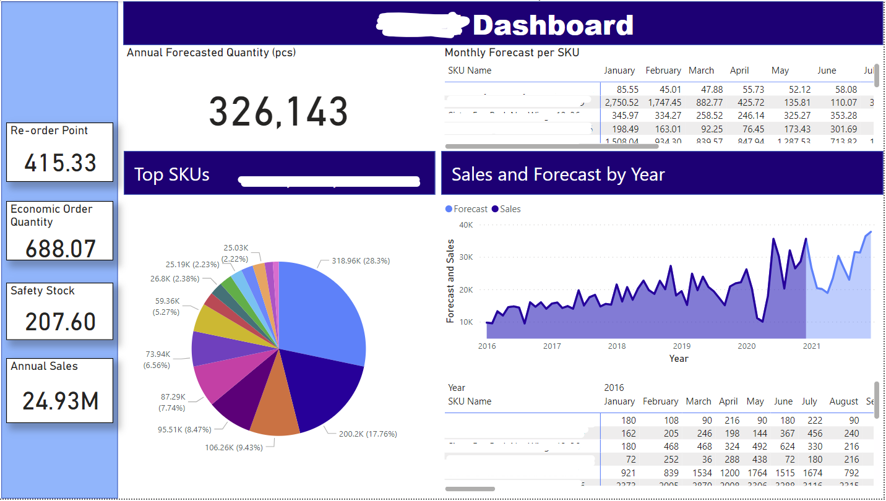
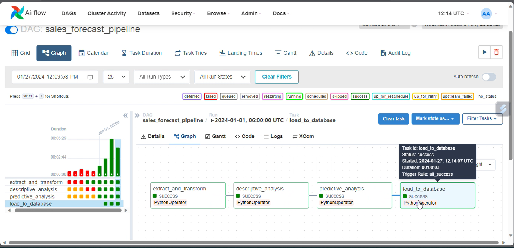

# Sales and Forecast Dashboard

## Project Overview
This project is the result of a partnership with a client who asked me to automate their data pipeline. 

An extract-transform-load (ETL) pipeline is built to collect the business data. These data are processed to generate insights and forecasts using exploratory data analysis (EDA) and predictive models. The results of the analyses are stored in a PostgreSQL database which connects to a Power BI dashboard.

Using Airflow, the entire flow of data from the source up to the Power BI dashboard is automated. The scripts are set to run monthy (every first day of the month at 6 AM). 

